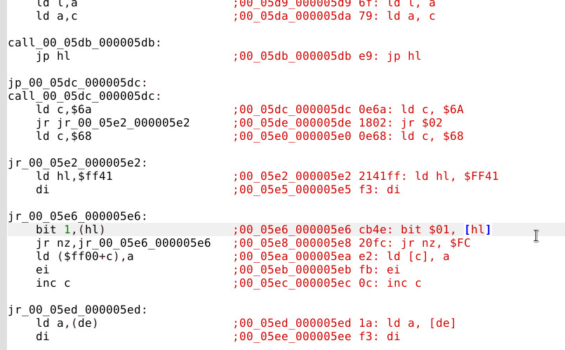

This is an extracted source code from star ocean blue sphere, done automatically using my own dynamic disassembler

#### The disassembly present in this repository does not represent its last version, it is being grouwn as the code extraction is automated and polished

I am trying to create new tools to analyze the code and generate relevant and comprehensive code.

# Facts about Star Ocean Blue Sphere and the current stage of the disassembler:
### label generation
### ~= 59000 Lines of code
### some random functions documented
### The code was 100% programmed by hand, in ASM, so, there are no compiler pattern, nor symbol information
### I am documenting the story of the programmers

If you have documented any part of the source code, please provide a symbols file so that we can grow the documentation, which is not possible to be done in an automated way.

# Building:
TO COMPILE: EXECUTE ./compile -> you will need wla-gb to compile

# Current state of the disassembler

